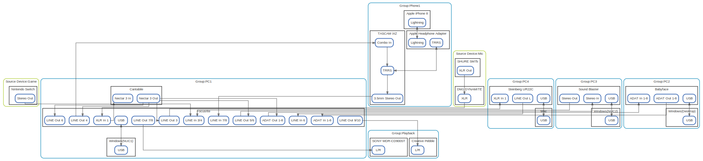

# オーディオ環境

  [ <a href="../ndiag.descriptions/_index.md">:pencil2: Edit description</a> ]

## Views

| Name | Description |
| --- | --- |
| [overview](view-overview.md) | <a href="../ndiag.descriptions/_view-overview.md">:pencil2:</a> |

## Nodes

| Name | Description |
| --- | --- |
| [Windows(NUC1)](node-windows(nuc1).md) | <a href="../ndiag.descriptions/_node-windows(nuc1).md">:pencil2:</a> |
| [Cantabile](node-cantabile.md) | <a href="../ndiag.descriptions/_node-cantabile.md">:pencil2:</a> |
| [Windows(Desktop)](node-windows(desktop).md) | <a href="../ndiag.descriptions/_node-windows(desktop).md">:pencil2:</a> |
| [Windows(NUC2)](node-windows(nuc2).md) | <a href="../ndiag.descriptions/_node-windows(nuc2).md">:pencil2:</a> |
| [Mac](node-mac.md) | <a href="../ndiag.descriptions/_node-mac.md">:pencil2:</a> |
| [Apple iPhone 8](node-apple_iphone_8.md) | <a href="../ndiag.descriptions/_node-apple_iphone_8.md">:pencil2:</a> |
| [SHURE SM7b](node-shure_sm7b.md) | <a href="../ndiag.descriptions/_node-shure_sm7b.md">:pencil2:</a> |
| [DM1 DYNAMITE](node-dm1_dynamite.md) | <a href="../ndiag.descriptions/_node-dm1_dynamite.md">:pencil2:</a> |
| [Nintendo Switch](node-nintendo_switch.md) | <a href="../ndiag.descriptions/_node-nintendo_switch.md">:pencil2:</a> |
| [SONY MDR-CD900ST](node-sony_mdr-cd900st.md) | <a href="../ndiag.descriptions/_node-sony_mdr-cd900st.md">:pencil2:</a> |
| [Creative Pebble](node-creative_pebble.md) | <a href="../ndiag.descriptions/_node-creative_pebble.md">:pencil2:</a> |
| [Focusrite](node-focusrite.md) | <a href="../ndiag.descriptions/_node-focusrite.md">:pencil2:</a> |
| [Babyface](node-babyface.md) | <a href="../ndiag.descriptions/_node-babyface.md">:pencil2:</a> |
| [Sound Blaster](node-sound_blaster.md) | <a href="../ndiag.descriptions/_node-sound_blaster.md">:pencil2:</a> |
| [Steinberg UR22C](node-steinberg_ur22c.md) | <a href="../ndiag.descriptions/_node-steinberg_ur22c.md">:pencil2:</a> |
| [TASCAM iXZ](node-tascam_ixz.md) | <a href="../ndiag.descriptions/_node-tascam_ixz.md">:pencil2:</a> |
| [Apple Headphone Adapter](node-apple_headphone_adapter.md) | <a href="../ndiag.descriptions/_node-apple_headphone_adapter.md">:pencil2:</a> |

## Layers

| Name | Description |
| --- | --- |
| [Group](layer-group.md) | <a href="../ndiag.descriptions/_layer-group.md">:pencil2:</a> |
| [Source Device](layer-source_device.md) | <a href="../ndiag.descriptions/_layer-source_device.md">:pencil2:</a> |

## Labels

| Name | Description |
| --- | --- |

---

> Generated by [ndiag](https://github.com/k1LoW/ndiag)
