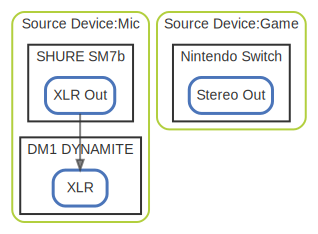

# Source Device

  [ <a href="../ndiag.descriptions/_layer-source_device.md">:pencil2: Edit description</a> ]

## Source Device:Mic

  [ <a href="../ndiag.descriptions/_cluster-source_device_mic.md">:pencil2: Edit description</a> ]

### Nodes

| Name | Description |
| --- | --- |
| [SHURE SM7b](node-shure_sm7b.md) | <a href="../ndiag.descriptions/_node-shure_sm7b.md">:pencil2:</a> |
| [DM1 DYNAMITE](node-dm1_dynamite.md) | <a href="../ndiag.descriptions/_node-dm1_dynamite.md">:pencil2:</a> |
## Source Device:Game

  [ <a href="../ndiag.descriptions/_cluster-source_device_game.md">:pencil2: Edit description</a> ]

### Nodes

| Name | Description |
| --- | --- |
| [Nintendo Switch](node-nintendo_switch.md) | <a href="../ndiag.descriptions/_node-nintendo_switch.md">:pencil2:</a> |

---

> Generated by [ndiag](https://github.com/k1LoW/ndiag)
