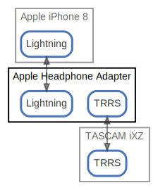

# Apple Headphone Adapter

  [ <a href="../ndiag.descriptions/_node-apple_headphone_adapter.md">:pencil2: Edit description</a> ]

## Components

| Name | Description | From (Relation) | To (Relation) |
| --- | --- | --- | --- |
| apple headphone adapter:trrs |  <a href="../ndiag.descriptions/_component-apple_headphone_adapter_trrs.md">:pencil2:</a> | [tascam ixz:trrs](node-tascam_ixz.md) | [tascam ixz:trrs](node-tascam_ixz.md) |
| apple headphone adapter:lightning |  <a href="../ndiag.descriptions/_component-apple_headphone_adapter_lightning.md">:pencil2:</a> | [apple iphone 8:lightning](node-apple_iphone_8.md) | [apple iphone 8:lightning](node-apple_iphone_8.md) |

## Labels

| Name | Description |
| --- | --- |

---

> Generated by [ndiag](https://github.com/k1LoW/ndiag)
