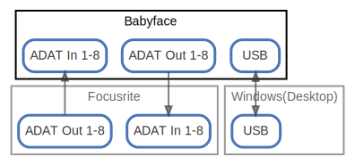

# Babyface

  [ <a href="../ndiag.descriptions/_node-babyface.md">:pencil2: Edit description</a> ]

## Components

| Name | Description | From (Relation) | To (Relation) |
| --- | --- | --- | --- |
| babyface:adat in 1-8 |  <a href="../ndiag.descriptions/_component-babyface_adat_in_1-8.md">:pencil2:</a> | [focusrite:adat out 1-8](node-focusrite.md) |  |
| babyface:adat out 1-8 |  <a href="../ndiag.descriptions/_component-babyface_adat_out_1-8.md">:pencil2:</a> |  | [focusrite:adat in 1-8](node-focusrite.md) |
| babyface:usb |  <a href="../ndiag.descriptions/_component-babyface_usb.md">:pencil2:</a> | [windows(desktop):usb](node-windows(desktop).md) | [windows(desktop):usb](node-windows(desktop).md) |

## Labels

| Name | Description |
| --- | --- |

---

> Generated by [ndiag](https://github.com/k1LoW/ndiag)
