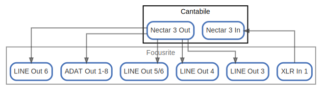

# Cantabile

  [ <a href="../ndiag.descriptions/_node-cantabile.md">:pencil2: Edit description</a> ]

## Components

| Name | Description | From (Relation) | To (Relation) |
| --- | --- | --- | --- |
| cantabile:nectar 3 in |  <a href="../ndiag.descriptions/_component-cantabile_nectar_3_in.md">:pencil2:</a> | [focusrite:xlr in 1](node-focusrite.md) |  |
| cantabile:nectar 3 out |  <a href="../ndiag.descriptions/_component-cantabile_nectar_3_out.md">:pencil2:</a> |  | [focusrite:adat out 1-8](node-focusrite.md) / [focusrite:line out 3](node-focusrite.md) / [focusrite:line out 4](node-focusrite.md) / [focusrite:line out 5/6](node-focusrite.md) / [focusrite:line out 6](node-focusrite.md) |

## Labels

| Name | Description |
| --- | --- |

---

> Generated by [ndiag](https://github.com/k1LoW/ndiag)
