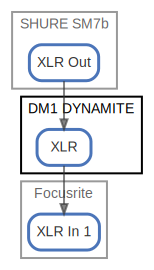

# DM1 DYNAMITE

  [ <a href="../ndiag.descriptions/_node-dm1_dynamite.md">:pencil2: Edit description</a> ]

## Components

| Name | Description | From (Relation) | To (Relation) |
| --- | --- | --- | --- |
| dm1 dynamite:xlr |  <a href="../ndiag.descriptions/_component-dm1_dynamite_xlr.md">:pencil2:</a> | [shure sm7b:xlr out](node-shure_sm7b.md) | [focusrite:xlr in 1](node-focusrite.md) |

## Labels

| Name | Description |
| --- | --- |

---

> Generated by [ndiag](https://github.com/k1LoW/ndiag)
