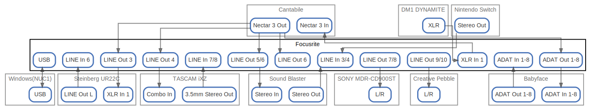

# Focusrite

  [ <a href="../ndiag.descriptions/_node-focusrite.md">:pencil2: Edit description</a> ]

## Components

| Name | Description | From (Relation) | To (Relation) |
| --- | --- | --- | --- |
| focusrite:usb |  <a href="../ndiag.descriptions/_component-focusrite_usb.md">:pencil2:</a> | [windows(nuc1):usb](node-windows(nuc1).md) | [windows(nuc1):usb](node-windows(nuc1).md) |
| focusrite:xlr in 1 |  <a href="../ndiag.descriptions/_component-focusrite_xlr_in_1.md">:pencil2:</a> | [dm1 dynamite:xlr](node-dm1_dynamite.md) | [cantabile:nectar 3 in](node-cantabile.md) |
| focusrite:line in 3/4 |  <a href="../ndiag.descriptions/_component-focusrite_line_in_3_4.md">:pencil2:</a> | [sound blaster:stereo out](node-sound_blaster.md) / [nintendo switch:stereo out](node-nintendo_switch.md) |  |
| focusrite:line in 6 |  <a href="../ndiag.descriptions/_component-focusrite_line_in_6.md">:pencil2:</a> | [steinberg ur22c:line out l](node-steinberg_ur22c.md) |  |
| focusrite:line in 7/8 |  <a href="../ndiag.descriptions/_component-focusrite_line_in_7_8.md">:pencil2:</a> | [tascam ixz:3.5mm stereo out](node-tascam_ixz.md) |  |
| focusrite:line out 3 |  <a href="../ndiag.descriptions/_component-focusrite_line_out_3.md">:pencil2:</a> | [cantabile:nectar 3 out](node-cantabile.md) | [steinberg ur22c:xlr in 1](node-steinberg_ur22c.md) |
| focusrite:line out 4 |  <a href="../ndiag.descriptions/_component-focusrite_line_out_4.md">:pencil2:</a> | [cantabile:nectar 3 out](node-cantabile.md) | [tascam ixz:combo in](node-tascam_ixz.md) |
| focusrite:line out 5/6 |  <a href="../ndiag.descriptions/_component-focusrite_line_out_5_6.md">:pencil2:</a> | [cantabile:nectar 3 out](node-cantabile.md) | [sound blaster:stereo in](node-sound_blaster.md) |
| focusrite:line out 7/8 |  <a href="../ndiag.descriptions/_component-focusrite_line_out_7_8.md">:pencil2:</a> |  | [sony mdr-cd900st:l/r](node-sony_mdr-cd900st.md) |
| focusrite:line out 9/10 |  <a href="../ndiag.descriptions/_component-focusrite_line_out_9_10.md">:pencil2:</a> |  | [creative pebble:l/r](node-creative_pebble.md) |
| focusrite:adat in 1-8 |  <a href="../ndiag.descriptions/_component-focusrite_adat_in_1-8.md">:pencil2:</a> | [babyface:adat out 1-8](node-babyface.md) |  |
| focusrite:adat out 1-8 |  <a href="../ndiag.descriptions/_component-focusrite_adat_out_1-8.md">:pencil2:</a> | [cantabile:nectar 3 out](node-cantabile.md) | [babyface:adat in 1-8](node-babyface.md) |
| focusrite:line out 6 |  <a href="../ndiag.descriptions/_component-focusrite_line_out_6.md">:pencil2:</a> | [cantabile:nectar 3 out](node-cantabile.md) |  |

## Labels

| Name | Description |
| --- | --- |

---

> Generated by [ndiag](https://github.com/k1LoW/ndiag)
