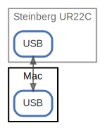

# Mac

  [ <a href="../ndiag.descriptions/_node-mac.md">:pencil2: Edit description</a> ]

## Components

| Name | Description | From (Relation) | To (Relation) |
| --- | --- | --- | --- |
| mac:usb |  <a href="../ndiag.descriptions/_component-mac_usb.md">:pencil2:</a> | [steinberg ur22c:usb](node-steinberg_ur22c.md) | [steinberg ur22c:usb](node-steinberg_ur22c.md) |

## Labels

| Name | Description |
| --- | --- |

---

> Generated by [ndiag](https://github.com/k1LoW/ndiag)
