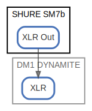

# SHURE SM7b

  [ <a href="../ndiag.descriptions/_node-shure_sm7b.md">:pencil2: Edit description</a> ]

## Components

| Name | Description | From (Relation) | To (Relation) |
| --- | --- | --- | --- |
| shure sm7b:xlr out |  <a href="../ndiag.descriptions/_component-shure_sm7b_xlr_out.md">:pencil2:</a> |  | [dm1 dynamite:xlr](node-dm1_dynamite.md) |

## Labels

| Name | Description |
| --- | --- |

---

> Generated by [ndiag](https://github.com/k1LoW/ndiag)
