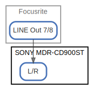

# SONY MDR-CD900ST

  [ <a href="../ndiag.descriptions/_node-sony_mdr-cd900st.md">:pencil2: Edit description</a> ]

## Components

| Name | Description | From (Relation) | To (Relation) |
| --- | --- | --- | --- |
| sony mdr-cd900st:l/r |  <a href="../ndiag.descriptions/_component-sony_mdr-cd900st_l_r.md">:pencil2:</a> | [focusrite:line out 7/8](node-focusrite.md) |  |

## Labels

| Name | Description |
| --- | --- |

---

> Generated by [ndiag](https://github.com/k1LoW/ndiag)
