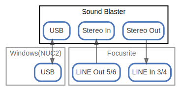

# Sound Blaster

  [ <a href="../ndiag.descriptions/_node-sound_blaster.md">:pencil2: Edit description</a> ]

## Components

| Name | Description | From (Relation) | To (Relation) |
| --- | --- | --- | --- |
| sound blaster:usb |  <a href="../ndiag.descriptions/_component-sound_blaster_usb.md">:pencil2:</a> | [windows(nuc2):usb](node-windows(nuc2).md) | [windows(nuc2):usb](node-windows(nuc2).md) |
| sound blaster:stereo in |  <a href="../ndiag.descriptions/_component-sound_blaster_stereo_in.md">:pencil2:</a> | [focusrite:line out 5/6](node-focusrite.md) |  |
| sound blaster:stereo out |  <a href="../ndiag.descriptions/_component-sound_blaster_stereo_out.md">:pencil2:</a> |  | [focusrite:line in 3/4](node-focusrite.md) |

## Labels

| Name | Description |
| --- | --- |

---

> Generated by [ndiag](https://github.com/k1LoW/ndiag)
