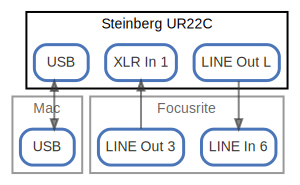

# Steinberg UR22C

  [ <a href="../ndiag.descriptions/_node-steinberg_ur22c.md">:pencil2: Edit description</a> ]

## Components

| Name | Description | From (Relation) | To (Relation) |
| --- | --- | --- | --- |
| steinberg ur22c:usb |  <a href="../ndiag.descriptions/_component-steinberg_ur22c_usb.md">:pencil2:</a> | [mac:usb](node-mac.md) | [mac:usb](node-mac.md) |
| steinberg ur22c:xlr in 1 |  <a href="../ndiag.descriptions/_component-steinberg_ur22c_xlr_in_1.md">:pencil2:</a> | [focusrite:line out 3](node-focusrite.md) |  |
| steinberg ur22c:line out l |  <a href="../ndiag.descriptions/_component-steinberg_ur22c_line_out_l.md">:pencil2:</a> |  | [focusrite:line in 6](node-focusrite.md) |

## Labels

| Name | Description |
| --- | --- |

---

> Generated by [ndiag](https://github.com/k1LoW/ndiag)
