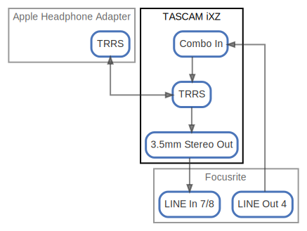

# TASCAM iXZ

  [ <a href="../ndiag.descriptions/_node-tascam_ixz.md">:pencil2: Edit description</a> ]

## Components

| Name | Description | From (Relation) | To (Relation) |
| --- | --- | --- | --- |
| tascam ixz:3.5mm stereo out |  <a href="../ndiag.descriptions/_component-tascam_ixz_3.5mm_stereo_out.md">:pencil2:</a> | [tascam ixz:trrs](node-tascam_ixz.md) | [focusrite:line in 7/8](node-focusrite.md) |
| tascam ixz:combo in |  <a href="../ndiag.descriptions/_component-tascam_ixz_combo_in.md">:pencil2:</a> | [focusrite:line out 4](node-focusrite.md) | [tascam ixz:trrs](node-tascam_ixz.md) |
| tascam ixz:trrs |  <a href="../ndiag.descriptions/_component-tascam_ixz_trrs.md">:pencil2:</a> | [tascam ixz:combo in](node-tascam_ixz.md) / [apple headphone adapter:trrs](node-apple_headphone_adapter.md) | [tascam ixz:3.5mm stereo out](node-tascam_ixz.md) / [apple headphone adapter:trrs](node-apple_headphone_adapter.md) |

## Labels

| Name | Description |
| --- | --- |

---

> Generated by [ndiag](https://github.com/k1LoW/ndiag)
