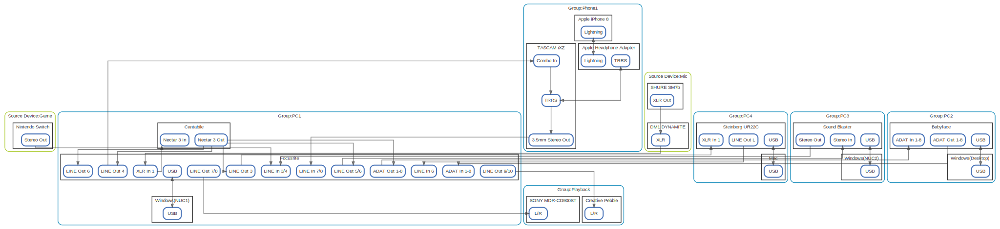
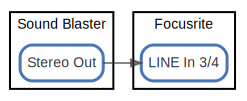

# overview

  [ <a href="../ndiag.descriptions/_view-overview.md">:pencil2: Edit description</a> ]

## Nodes

| Name | Description |
| --- | --- |
| [Windows(NUC1)](node-windows(nuc1).md) | <a href="../ndiag.descriptions/_node-windows(nuc1).md">:pencil2:</a> |
| [Cantabile](node-cantabile.md) | <a href="../ndiag.descriptions/_node-cantabile.md">:pencil2:</a> |
| [Windows(Desktop)](node-windows(desktop).md) | <a href="../ndiag.descriptions/_node-windows(desktop).md">:pencil2:</a> |
| [Windows(NUC2)](node-windows(nuc2).md) | <a href="../ndiag.descriptions/_node-windows(nuc2).md">:pencil2:</a> |
| [Mac](node-mac.md) | <a href="../ndiag.descriptions/_node-mac.md">:pencil2:</a> |
| [Apple iPhone 8](node-apple_iphone_8.md) | <a href="../ndiag.descriptions/_node-apple_iphone_8.md">:pencil2:</a> |
| [SHURE SM7b](node-shure_sm7b.md) | <a href="../ndiag.descriptions/_node-shure_sm7b.md">:pencil2:</a> |
| [DM1 DYNAMITE](node-dm1_dynamite.md) | <a href="../ndiag.descriptions/_node-dm1_dynamite.md">:pencil2:</a> |
| [Nintendo Switch](node-nintendo_switch.md) | <a href="../ndiag.descriptions/_node-nintendo_switch.md">:pencil2:</a> |
| [SONY MDR-CD900ST](node-sony_mdr-cd900st.md) | <a href="../ndiag.descriptions/_node-sony_mdr-cd900st.md">:pencil2:</a> |
| [Creative Pebble](node-creative_pebble.md) | <a href="../ndiag.descriptions/_node-creative_pebble.md">:pencil2:</a> |
| [Focusrite](node-focusrite.md) | <a href="../ndiag.descriptions/_node-focusrite.md">:pencil2:</a> |
| [Babyface](node-babyface.md) | <a href="../ndiag.descriptions/_node-babyface.md">:pencil2:</a> |
| [Sound Blaster](node-sound_blaster.md) | <a href="../ndiag.descriptions/_node-sound_blaster.md">:pencil2:</a> |
| [Steinberg UR22C](node-steinberg_ur22c.md) | <a href="../ndiag.descriptions/_node-steinberg_ur22c.md">:pencil2:</a> |
| [TASCAM iXZ](node-tascam_ixz.md) | <a href="../ndiag.descriptions/_node-tascam_ixz.md">:pencil2:</a> |
| [Apple Headphone Adapter](node-apple_headphone_adapter.md) | <a href="../ndiag.descriptions/_node-apple_headphone_adapter.md">:pencil2:</a> |

## Relations

##### `shure sm7b:xlr out-74853bf`

  [ <a href="../ndiag.descriptions/_relation-shure_sm7b_xlr_out-74853bf.md">:pencil2: Edit description</a> ]

| # | Component | Description |
| --- | --- | --- |
| 0 | shure sm7b:xlr out |  <a href="../ndiag.descriptions/_component-shure_sm7b_xlr_out.md">:pencil2:</a> |
| 1 | dm1 dynamite:xlr |  <a href="../ndiag.descriptions/_component-dm1_dynamite_xlr.md">:pencil2:</a> |

---

##### `dm1 dynamite:xlr-46f3328`

  [ <a href="../ndiag.descriptions/_relation-dm1_dynamite_xlr-46f3328.md">:pencil2: Edit description</a> ]

| # | Component | Description |
| --- | --- | --- |
| 0 | dm1 dynamite:xlr |  <a href="../ndiag.descriptions/_component-dm1_dynamite_xlr.md">:pencil2:</a> |
| 1 | focusrite:xlr in 1 |  <a href="../ndiag.descriptions/_component-focusrite_xlr_in_1.md">:pencil2:</a> |

---

##### `cantabile:nectar 3 out-886ee2d`

  [ <a href="../ndiag.descriptions/_relation-cantabile_nectar_3_out-886ee2d.md">:pencil2: Edit description</a> ]

| # | Component | Description |
| --- | --- | --- |
| 0 | cantabile:nectar 3 out |  <a href="../ndiag.descriptions/_component-cantabile_nectar_3_out.md">:pencil2:</a> |
| 1 | focusrite:adat out 1-8 |  <a href="../ndiag.descriptions/_component-focusrite_adat_out_1-8.md">:pencil2:</a> |

---

##### `focusrite:xlr in 1-d6219b4`

  [ <a href="../ndiag.descriptions/_relation-focusrite_xlr_in_1-d6219b4.md">:pencil2: Edit description</a> ]

| # | Component | Description |
| --- | --- | --- |
| 0 | focusrite:xlr in 1 |  <a href="../ndiag.descriptions/_component-focusrite_xlr_in_1.md">:pencil2:</a> |
| 1 | cantabile:nectar 3 in |  <a href="../ndiag.descriptions/_component-cantabile_nectar_3_in.md">:pencil2:</a> |

---

##### `cantabile:nectar 3 out-952250a`

  [ <a href="../ndiag.descriptions/_relation-cantabile_nectar_3_out-952250a.md">:pencil2: Edit description</a> ]

| # | Component | Description |
| --- | --- | --- |
| 0 | cantabile:nectar 3 out |  <a href="../ndiag.descriptions/_component-cantabile_nectar_3_out.md">:pencil2:</a> |
| 1 | focusrite:line out 3 |  <a href="../ndiag.descriptions/_component-focusrite_line_out_3.md">:pencil2:</a> |

---

##### `cantabile:nectar 3 out-60211b1`

  [ <a href="../ndiag.descriptions/_relation-cantabile_nectar_3_out-60211b1.md">:pencil2: Edit description</a> ]

| # | Component | Description |
| --- | --- | --- |
| 0 | cantabile:nectar 3 out |  <a href="../ndiag.descriptions/_component-cantabile_nectar_3_out.md">:pencil2:</a> |
| 1 | focusrite:line out 4 |  <a href="../ndiag.descriptions/_component-focusrite_line_out_4.md">:pencil2:</a> |

---

##### `cantabile:nectar 3 out-42f8439`

  [ <a href="../ndiag.descriptions/_relation-cantabile_nectar_3_out-42f8439.md">:pencil2: Edit description</a> ]

| # | Component | Description |
| --- | --- | --- |
| 0 | cantabile:nectar 3 out |  <a href="../ndiag.descriptions/_component-cantabile_nectar_3_out.md">:pencil2:</a> |
| 1 | focusrite:line out 5/6 |  <a href="../ndiag.descriptions/_component-focusrite_line_out_5_6.md">:pencil2:</a> |

---

##### `cantabile:nectar 3 out-83c80f6`

  [ <a href="../ndiag.descriptions/_relation-cantabile_nectar_3_out-83c80f6.md">:pencil2: Edit description</a> ]

| # | Component | Description |
| --- | --- | --- |
| 0 | cantabile:nectar 3 out |  <a href="../ndiag.descriptions/_component-cantabile_nectar_3_out.md">:pencil2:</a> |
| 1 | focusrite:line out 6 |  <a href="../ndiag.descriptions/_component-focusrite_line_out_6.md">:pencil2:</a> |

---

##### `windows(nuc1):usb-5eb0402`

_usb-5eb0402.svg)

  [ <a href="../ndiag.descriptions/_relation-windows(nuc1)_usb-5eb0402.md">:pencil2: Edit description</a> ]

| # | Component | Description |
| --- | --- | --- |
| 0 | windows(nuc1):usb |  <a href="../ndiag.descriptions/_component-windows(nuc1)_usb.md">:pencil2:</a> |
| 1 | focusrite:usb |  <a href="../ndiag.descriptions/_component-focusrite_usb.md">:pencil2:</a> |

---

##### `focusrite:usb-3a93f93`

  [ <a href="../ndiag.descriptions/_relation-focusrite_usb-3a93f93.md">:pencil2: Edit description</a> ]

| # | Component | Description |
| --- | --- | --- |
| 0 | focusrite:usb |  <a href="../ndiag.descriptions/_component-focusrite_usb.md">:pencil2:</a> |
| 1 | windows(nuc1):usb |  <a href="../ndiag.descriptions/_component-windows(nuc1)_usb.md">:pencil2:</a> |

---

##### `windows(desktop):usb-4b6e64a`

_usb-4b6e64a.svg)

  [ <a href="../ndiag.descriptions/_relation-windows(desktop)_usb-4b6e64a.md">:pencil2: Edit description</a> ]

| # | Component | Description |
| --- | --- | --- |
| 0 | windows(desktop):usb |  <a href="../ndiag.descriptions/_component-windows(desktop)_usb.md">:pencil2:</a> |
| 1 | babyface:usb |  <a href="../ndiag.descriptions/_component-babyface_usb.md">:pencil2:</a> |

---

##### `babyface:usb-28df813`

  [ <a href="../ndiag.descriptions/_relation-babyface_usb-28df813.md">:pencil2: Edit description</a> ]

| # | Component | Description |
| --- | --- | --- |
| 0 | babyface:usb |  <a href="../ndiag.descriptions/_component-babyface_usb.md">:pencil2:</a> |
| 1 | windows(desktop):usb |  <a href="../ndiag.descriptions/_component-windows(desktop)_usb.md">:pencil2:</a> |

---

##### `focusrite:adat out 1-8-8f3697a`

  [ <a href="../ndiag.descriptions/_relation-focusrite_adat_out_1-8-8f3697a.md">:pencil2: Edit description</a> ]

| # | Component | Description |
| --- | --- | --- |
| 0 | focusrite:adat out 1-8 |  <a href="../ndiag.descriptions/_component-focusrite_adat_out_1-8.md">:pencil2:</a> |
| 1 | babyface:adat in 1-8 |  <a href="../ndiag.descriptions/_component-babyface_adat_in_1-8.md">:pencil2:</a> |

---

##### `babyface:adat out 1-8-d615308`

  [ <a href="../ndiag.descriptions/_relation-babyface_adat_out_1-8-d615308.md">:pencil2: Edit description</a> ]

| # | Component | Description |
| --- | --- | --- |
| 0 | babyface:adat out 1-8 |  <a href="../ndiag.descriptions/_component-babyface_adat_out_1-8.md">:pencil2:</a> |
| 1 | focusrite:adat in 1-8 |  <a href="../ndiag.descriptions/_component-focusrite_adat_in_1-8.md">:pencil2:</a> |

---

##### `windows(nuc2):usb-0cbb458`

_usb-0cbb458.svg)

  [ <a href="../ndiag.descriptions/_relation-windows(nuc2)_usb-0cbb458.md">:pencil2: Edit description</a> ]

| # | Component | Description |
| --- | --- | --- |
| 0 | windows(nuc2):usb |  <a href="../ndiag.descriptions/_component-windows(nuc2)_usb.md">:pencil2:</a> |
| 1 | sound blaster:usb |  <a href="../ndiag.descriptions/_component-sound_blaster_usb.md">:pencil2:</a> |

---

##### `sound blaster:usb-bcf79da`

  [ <a href="../ndiag.descriptions/_relation-sound_blaster_usb-bcf79da.md">:pencil2: Edit description</a> ]

| # | Component | Description |
| --- | --- | --- |
| 0 | sound blaster:usb |  <a href="../ndiag.descriptions/_component-sound_blaster_usb.md">:pencil2:</a> |
| 1 | windows(nuc2):usb |  <a href="../ndiag.descriptions/_component-windows(nuc2)_usb.md">:pencil2:</a> |

---

##### `sound blaster:stereo out-fa67b8d`

  [ <a href="../ndiag.descriptions/_relation-sound_blaster_stereo_out-fa67b8d.md">:pencil2: Edit description</a> ]

| # | Component | Description |
| --- | --- | --- |
| 0 | sound blaster:stereo out |  <a href="../ndiag.descriptions/_component-sound_blaster_stereo_out.md">:pencil2:</a> |
| 1 | focusrite:line in 3/4 |  <a href="../ndiag.descriptions/_component-focusrite_line_in_3_4.md">:pencil2:</a> |

---

##### `focusrite:line out 5/6-3142a5c`

  [ <a href="../ndiag.descriptions/_relation-focusrite_line_out_5_6-3142a5c.md">:pencil2: Edit description</a> ]

| # | Component | Description |
| --- | --- | --- |
| 0 | focusrite:line out 5/6 |  <a href="../ndiag.descriptions/_component-focusrite_line_out_5_6.md">:pencil2:</a> |
| 1 | sound blaster:stereo in |  <a href="../ndiag.descriptions/_component-sound_blaster_stereo_in.md">:pencil2:</a> |

---

##### `mac:usb-47f688e`

  [ <a href="../ndiag.descriptions/_relation-mac_usb-47f688e.md">:pencil2: Edit description</a> ]

| # | Component | Description |
| --- | --- | --- |
| 0 | mac:usb |  <a href="../ndiag.descriptions/_component-mac_usb.md">:pencil2:</a> |
| 1 | steinberg ur22c:usb |  <a href="../ndiag.descriptions/_component-steinberg_ur22c_usb.md">:pencil2:</a> |

---

##### `steinberg ur22c:usb-f1ac0c6`

  [ <a href="../ndiag.descriptions/_relation-steinberg_ur22c_usb-f1ac0c6.md">:pencil2: Edit description</a> ]

| # | Component | Description |
| --- | --- | --- |
| 0 | steinberg ur22c:usb |  <a href="../ndiag.descriptions/_component-steinberg_ur22c_usb.md">:pencil2:</a> |
| 1 | mac:usb |  <a href="../ndiag.descriptions/_component-mac_usb.md">:pencil2:</a> |

---

##### `focusrite:line out 3-0881fee`

  [ <a href="../ndiag.descriptions/_relation-focusrite_line_out_3-0881fee.md">:pencil2: Edit description</a> ]

| # | Component | Description |
| --- | --- | --- |
| 0 | focusrite:line out 3 |  <a href="../ndiag.descriptions/_component-focusrite_line_out_3.md">:pencil2:</a> |
| 1 | steinberg ur22c:xlr in 1 |  <a href="../ndiag.descriptions/_component-steinberg_ur22c_xlr_in_1.md">:pencil2:</a> |

---

##### `steinberg ur22c:line out l-10a61a4`

  [ <a href="../ndiag.descriptions/_relation-steinberg_ur22c_line_out_l-10a61a4.md">:pencil2: Edit description</a> ]

| # | Component | Description |
| --- | --- | --- |
| 0 | steinberg ur22c:line out l |  <a href="../ndiag.descriptions/_component-steinberg_ur22c_line_out_l.md">:pencil2:</a> |
| 1 | focusrite:line in 6 |  <a href="../ndiag.descriptions/_component-focusrite_line_in_6.md">:pencil2:</a> |

---

##### `focusrite:line out 4-191b340`

  [ <a href="../ndiag.descriptions/_relation-focusrite_line_out_4-191b340.md">:pencil2: Edit description</a> ]

| # | Component | Description |
| --- | --- | --- |
| 0 | focusrite:line out 4 |  <a href="../ndiag.descriptions/_component-focusrite_line_out_4.md">:pencil2:</a> |
| 1 | tascam ixz:combo in |  <a href="../ndiag.descriptions/_component-tascam_ixz_combo_in.md">:pencil2:</a> |

---

##### `tascam ixz:3.5mm stereo out-13dd4c1`

  [ <a href="../ndiag.descriptions/_relation-tascam_ixz_3.5mm_stereo_out-13dd4c1.md">:pencil2: Edit description</a> ]

| # | Component | Description |
| --- | --- | --- |
| 0 | tascam ixz:3.5mm stereo out |  <a href="../ndiag.descriptions/_component-tascam_ixz_3.5mm_stereo_out.md">:pencil2:</a> |
| 1 | focusrite:line in 7/8 |  <a href="../ndiag.descriptions/_component-focusrite_line_in_7_8.md">:pencil2:</a> |

---

##### `tascam ixz:trrs-f90112c`

  [ <a href="../ndiag.descriptions/_relation-tascam_ixz_trrs-f90112c.md">:pencil2: Edit description</a> ]

| # | Component | Description |
| --- | --- | --- |
| 0 | tascam ixz:trrs |  <a href="../ndiag.descriptions/_component-tascam_ixz_trrs.md">:pencil2:</a> |
| 1 | tascam ixz:3.5mm stereo out |  <a href="../ndiag.descriptions/_component-tascam_ixz_3.5mm_stereo_out.md">:pencil2:</a> |

---

##### `tascam ixz:combo in-36afe89`

  [ <a href="../ndiag.descriptions/_relation-tascam_ixz_combo_in-36afe89.md">:pencil2: Edit description</a> ]

| # | Component | Description |
| --- | --- | --- |
| 0 | tascam ixz:combo in |  <a href="../ndiag.descriptions/_component-tascam_ixz_combo_in.md">:pencil2:</a> |
| 1 | tascam ixz:trrs |  <a href="../ndiag.descriptions/_component-tascam_ixz_trrs.md">:pencil2:</a> |

---

##### `tascam ixz:trrs-a72ddf8`

  [ <a href="../ndiag.descriptions/_relation-tascam_ixz_trrs-a72ddf8.md">:pencil2: Edit description</a> ]

| # | Component | Description |
| --- | --- | --- |
| 0 | tascam ixz:trrs |  <a href="../ndiag.descriptions/_component-tascam_ixz_trrs.md">:pencil2:</a> |
| 1 | apple headphone adapter:trrs |  <a href="../ndiag.descriptions/_component-apple_headphone_adapter_trrs.md">:pencil2:</a> |

---

##### `apple headphone adapter:trrs-b34bf71`

  [ <a href="../ndiag.descriptions/_relation-apple_headphone_adapter_trrs-b34bf71.md">:pencil2: Edit description</a> ]

| # | Component | Description |
| --- | --- | --- |
| 0 | apple headphone adapter:trrs |  <a href="../ndiag.descriptions/_component-apple_headphone_adapter_trrs.md">:pencil2:</a> |
| 1 | tascam ixz:trrs |  <a href="../ndiag.descriptions/_component-tascam_ixz_trrs.md">:pencil2:</a> |

---

##### `apple headphone adapter:lightning-e055972`

  [ <a href="../ndiag.descriptions/_relation-apple_headphone_adapter_lightning-e055972.md">:pencil2: Edit description</a> ]

| # | Component | Description |
| --- | --- | --- |
| 0 | apple headphone adapter:lightning |  <a href="../ndiag.descriptions/_component-apple_headphone_adapter_lightning.md">:pencil2:</a> |
| 1 | apple iphone 8:lightning |  <a href="../ndiag.descriptions/_component-apple_iphone_8_lightning.md">:pencil2:</a> |

---

##### `apple iphone 8:lightning-2392853`

  [ <a href="../ndiag.descriptions/_relation-apple_iphone_8_lightning-2392853.md">:pencil2: Edit description</a> ]

| # | Component | Description |
| --- | --- | --- |
| 0 | apple iphone 8:lightning |  <a href="../ndiag.descriptions/_component-apple_iphone_8_lightning.md">:pencil2:</a> |
| 1 | apple headphone adapter:lightning |  <a href="../ndiag.descriptions/_component-apple_headphone_adapter_lightning.md">:pencil2:</a> |

---

##### `nintendo switch:stereo out-1351359`

  [ <a href="../ndiag.descriptions/_relation-nintendo_switch_stereo_out-1351359.md">:pencil2: Edit description</a> ]

| # | Component | Description |
| --- | --- | --- |
| 0 | nintendo switch:stereo out |  <a href="../ndiag.descriptions/_component-nintendo_switch_stereo_out.md">:pencil2:</a> |
| 1 | focusrite:line in 3/4 |  <a href="../ndiag.descriptions/_component-focusrite_line_in_3_4.md">:pencil2:</a> |

---

##### `focusrite:line out 7/8-29d4dd9`

  [ <a href="../ndiag.descriptions/_relation-focusrite_line_out_7_8-29d4dd9.md">:pencil2: Edit description</a> ]

| # | Component | Description |
| --- | --- | --- |
| 0 | focusrite:line out 7/8 |  <a href="../ndiag.descriptions/_component-focusrite_line_out_7_8.md">:pencil2:</a> |
| 1 | sony mdr-cd900st:l/r |  <a href="../ndiag.descriptions/_component-sony_mdr-cd900st_l_r.md">:pencil2:</a> |

---

##### `focusrite:line out 9/10-de1571d`

  [ <a href="../ndiag.descriptions/_relation-focusrite_line_out_9_10-de1571d.md">:pencil2: Edit description</a> ]

| # | Component | Description |
| --- | --- | --- |
| 0 | focusrite:line out 9/10 |  <a href="../ndiag.descriptions/_component-focusrite_line_out_9_10.md">:pencil2:</a> |
| 1 | creative pebble:l/r |  <a href="../ndiag.descriptions/_component-creative_pebble_l_r.md">:pencil2:</a> |

---
## Layers

| Name | Description |
| --- | --- |
| [Source Device](layer-source_device.md) | <a href="../ndiag.descriptions/_layer-source_device.md">:pencil2:</a> |
| [Group](layer-group.md) | <a href="../ndiag.descriptions/_layer-group.md">:pencil2:</a> |

## Labels

| Name | Description |
| --- | --- |

---

> Generated by [ndiag](https://github.com/k1LoW/ndiag)
